# IOs Mobile Dev Projects | Learning SwiftUi, Node-red, IBM cloud services

[versão em português](README.pt.md)

This repository contains projects that were developed during the Cloud Service practices course with a focus on iOS mobile development, RESTful API development with Node-RED for data processing and reading with IBM cloud services, and IoT solution development using hardware such as sensors and microcontrollers.

## Maker Space HackaTruck
The Maker Space HackaTruck is a project that consists of a space that can be transported through different cities, designed to encourage creativity and innovation. The HackaTruck is equipped with various tools and materials to allow users to build their own projects, exploring concepts of electronics, programming, and much more. The infrastructure includes M2 Macbooks, SE iPhones, 3D printers, laser cutters, microcontrollers, sensors, and all necessary components for hardware prototyping.

| 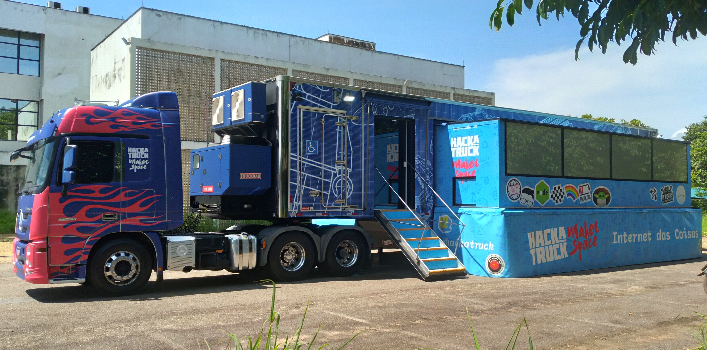 | 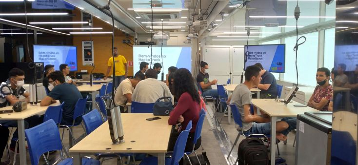 |
| -------- | ---------- |

## Node-Red API's with Cloud Services
In the course, along with the learning of technological solutions with iOS and hardware development, we used Node-RED to quickly prototype APIs for communication between the different projects and IBM cloud services (IBM Cloudant, IBM Watson, and IoT Services).

## IoT Service
During the course, we worked with microcontroller hardware and various sensors in connection with the IBM Cloud IoT service. We built prototypes with WiFi connection to the internet and developed dashboard panels to display the data.

https://user-images.githubusercontent.com/38532339/219828215-8c858837-d08e-4b9f-97d5-3155fca03519.mp4

| 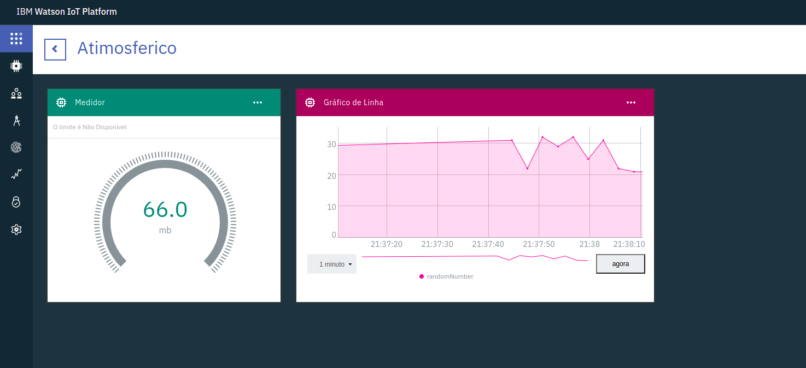 | 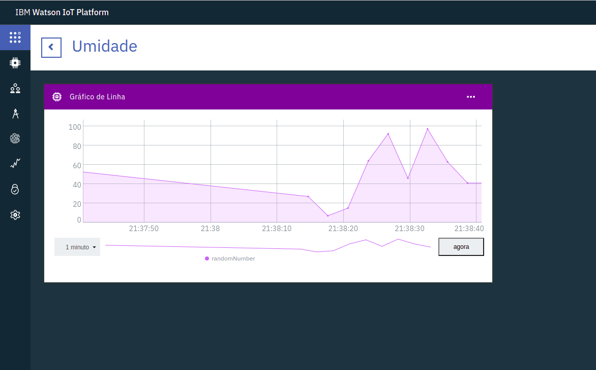 |
| -------- | ---------- |

## Repository Contents:
Below is a summary of the contents of this repository. In addition to these contents, the course also included a larger final project, whose planning was started from the first classes, focused on promoting a solution developed by us students (each group with 4 students) and implementing an MVP using the knowledge obtained. The project was successful and involved a good part of these studied technologies. Having a separated repository, this project is private for now, for restricted presentations.

   
### Aula1
Aula1 is a basic project that presents the fundamental concepts of iOS application development with Swift. The project includes concepts such as views, texts, and buttons, showing how to create a simple application from scratch.

 

---
### Aula2
Aula2 is a continuation of Aula1, where more advanced concepts of iOS development with Swift are explored. In this section, it is possible to see how to work with images, backgrounds, alerts, and text fields, showing more Swift development resources.

https://user-images.githubusercontent.com/38532339/219828064-8e13c8ff-99ac-43d9-b847-2026db4b04e8.mp4

 

---
### Aula2IMC
Aula2IMC is a project that allows the calculation of body mass index (BMI) and presents a reference table for the user. The application has a background that changes color according to the calculation result, making the user experience more visual and interactive.

https://user-images.githubusercontent.com/38532339/219828077-4da1e096-fc01-4ba6-90e5-f49037dd4cb2.mp4

 

---
### Aula5DataRequest
Aula5DataRequest is a basic project that demonstrates how to use the RESTful API created with Node-RED to make GET requests and obtain data in an iOS application.

    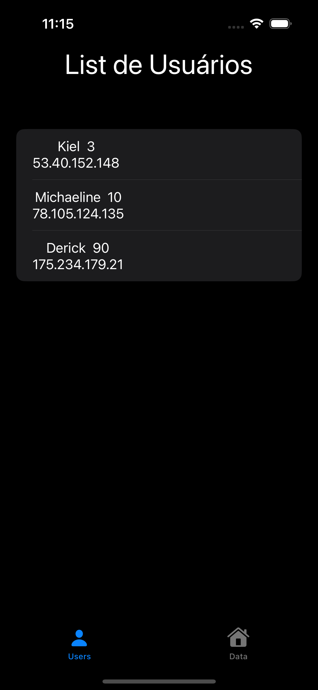

 

---
### Aula3TabView
The Aula3TabView is a project that introduces the concept of TabView and Navigation View, allowing the user to navigate through different screens of the application in an easy and intuitive way.

https://user-images.githubusercontent.com/38532339/219828089-3a771b14-7810-430f-a3bc-7a5f17385145.mp4

 

---
### HackaFM
HackaFM is an application that allows the user to select and play music, similar to popular apps like Spotify. The application was developed to explore advanced features of IOS development such as vertical and horizontal scrollviews, navigation, requests and data handling, and audio file manipulation.

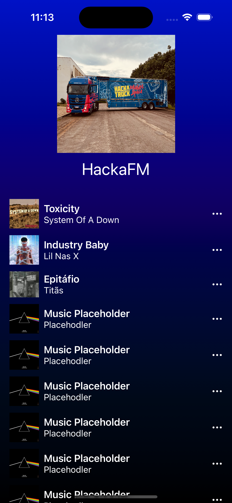 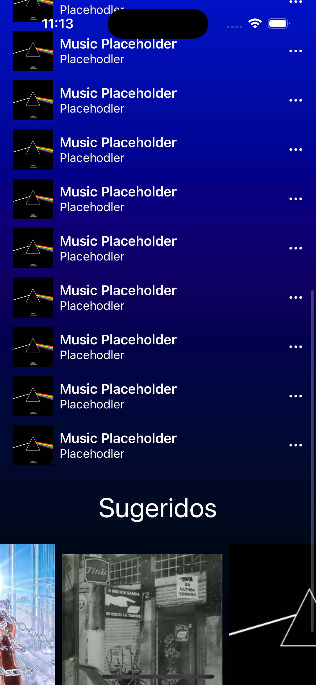

  

---
### MapAPP
The MapAPP is an application that allows users to save a list of locations and view them on an interactive map. The app uses a Restful API developed with Node-red and connected to a database on IBM's Claudant service to retrieve already saved locations and save new locations selected by the user on the map. With MapAPP, it's possible to add new locations directly on the map, using a post request functionality provided by the API.

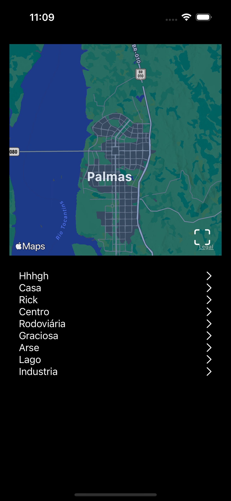 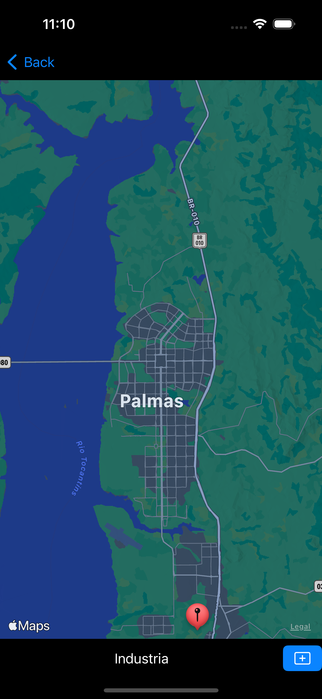

  

---

### Node-Red Flows
This section contains the node-red flows implemented and used in these projects and during the course, showing how to use Node-Red to create Restful APIs that utilize IBM cloud services. The examples include Node-Red exported flows and demonstrate how it's possible to create data read and write services using the Cloudant database and the IBM Watson speech-to-text and text-to-speech services.

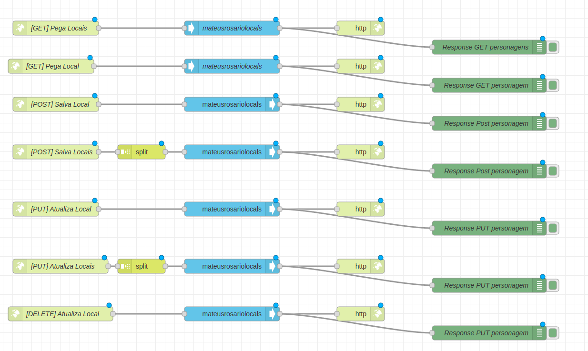
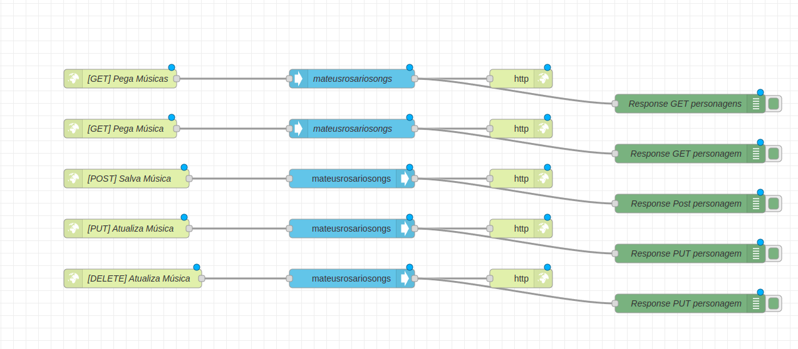
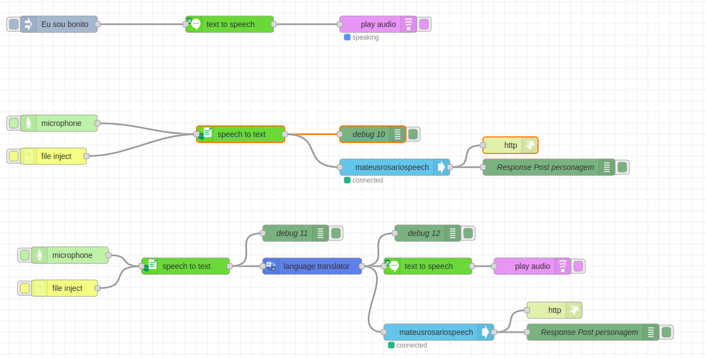
