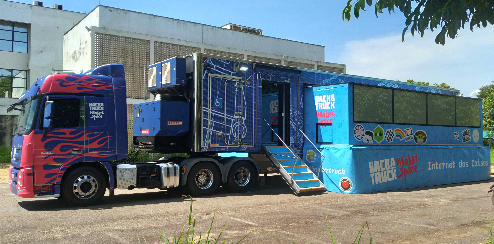
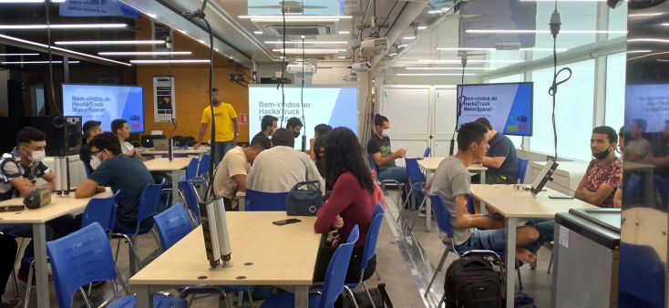
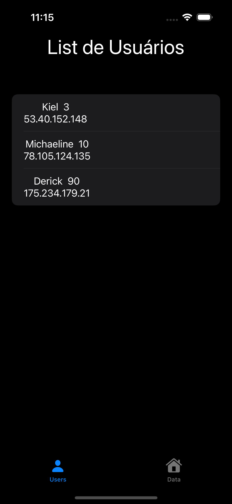
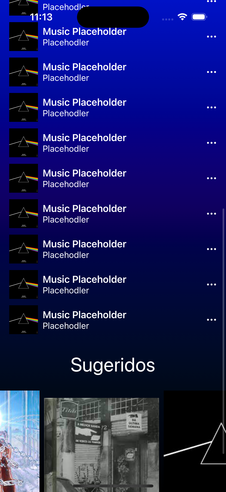
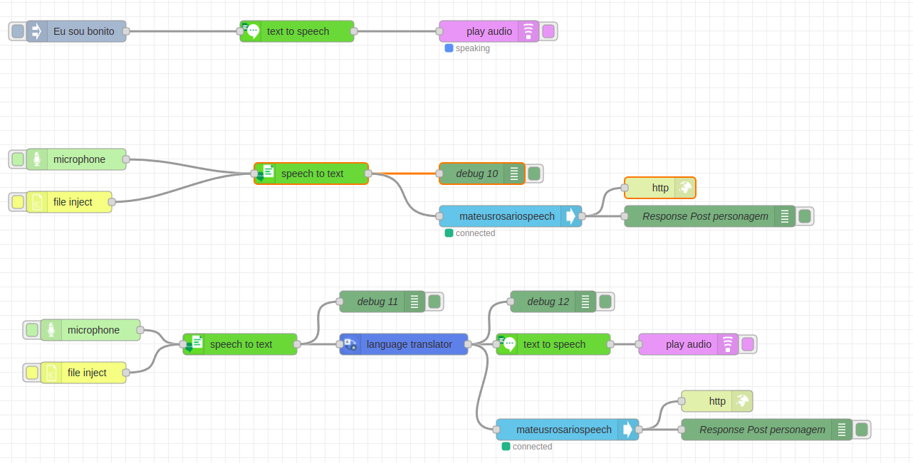

# IOs Mobile Dev Projects | Learning SwiftUi, Node-red, IBM cloud services

[english version](README.md)

Este repositório contém projetos que foram desenvolvidos durante o curso de práticas de Cloud Service com foco em desenvolvimento mobile IOS, desenvolvimento de APIs Restfull com Node-Red para leituras e tratamento de dados com serviços na nuvem da IBM e desenvolvimentos de soluções com internet das coisas, usando hardwere como sensores e microcontroladores.

## Maker Space HackaTruck
O Maker Space HackaTruck é um projeto que consiste em um espaço móvel para incentivar a criatividade e a inovação. O HackaTruck é equipado com diversas ferramentas e materiais para permitir que os usuários possam construir seus próprios projetos, explorando conceitos de eletrônica, programação e muito mais. Uma infraestrutura que inclue Macbooks M2, Iphones SE, impressoras 3D, cortadoras a laser, microcontroladores, sensores e todos os componentes nescessrios para prototipação de solução de hardwere.

|  |  |
| -------- | ---------- |

## Node-Red APIs with Cloud Services
Dentro do curso, juntamente com o aprendizado de soluções tecnologicas com desenvolvimento para IOS e hardwere, utilizamos Node-red para prototipar APIs de forma rápida para comunicação entre os diferentes projetos e os seviços em nuvem da IBM (IBM claudant, IBM Watson e Iot Services).

## IoT Service
Durante o curso trabalhamos com hardwere microcontroladores e diversos sensores em conecção com o serviço de Iot (Internet das Coisas) da IBM Cloud. Montando prótótipos com conecção via wifi com a internet e elaboração de painéis dashboard para mostrar os dados.

|  |  |
| -------- | ---------- |

## Conteúdos do Repositório:
Segue abaixo um resumo dos conteúdos desde repositório. Além destes conteúdos o curso também compreendeu um projeto final maior, que teve seu planejamento iniciado desde as primeiras aulas com foco em promover uma solução desenvolvida por nós alunos (grupos de 4 alunos) e implementar um MVP utilizando os conhecimentos obtidos. com apresentação na aula final. O projeto foi bem sucedido e envolveu boa parte dessas tecnologias estudadas, com um repositório separado, este projeto está privado por enquanto, para apresentações restritas.

   
### Aula1
A Aula1 é um projeto básico que apresenta os conceitos fundamentais de desenvolvimento de aplicativos IOS com Swift. O projeto inclui conceitos como views, textos e botões, mostrando como criar um aplicativo simples a partir do zero.

 

---
### Aula2
A Aula2 é uma continuação da Aula1, onde são explorados conceitos mais avançados do desenvolvimento IOS com Swift. Nesta seção, é possível ver como trabalhar com imagens, backgrounds, alertas e text field, mostrando mais recursos do desenvolvimento swift.

    

 

---
### Aula2IMC
A Aula2IMC é um projeto que permite o cálculo do índice de massa corporal (IMC) e apresenta uma tabela de referência para o usuário. O aplicativo possui um background que muda de cor de acordo com o resultado do cálculo, tornando a experiência do usuário mais visual e interativa.

 

---
### Aula5DataRequest
A Aula5DataRequest é um projeto básico que demonstra como utilizar a API Restful criada com Node-Red para fazer requisições GET e obter dados em um aplicativo IOS.

    

 

---
### Aula3TabView
A Aula3TabView é um projeto que apresenta o conceito de TabView e Navigation View, permitindo que o usuário navegue por diferentes telas do aplicativo de forma fácil e intuitiva.

    

 

---
### HackaFM
O HackaFM é um aplicativo que permite ao usuário escolher e reproduzir músicas, semelhante a aplicativos famosos como o Spotify. O aplicativo foi desenvolvido para explorar recursos avançados do desenvolvimento IOS, como scrowviews verticais e horizontais, navegação, requisições e manipulação de dados, e a manipulação de arquivos de áudio.

 

  

---
### MapAPP
O MapAPP é um aplicativo que permite aos usuários salvar uma lista de locais e visualizá-los em um mapa interativo. O aplicativo utiliza uma API Restful desenvolvida com Node-red e conectada a um banco de dados no serviço Claudant da IBM para buscar os locais já salvos e salvar os novos locais que o usuário selecionar no mapa. Com o MapAPP, é possível adicionar novos locais diretamente no mapa, utilizando uma funcionalidade de post request disponibilizada pela API.

 

  

---

### Node-Red Flows
Esta seção contém exemplos de como utilizar o Node-Red para criar APIs Restful que utilizam serviços de nuvem da IBM. Os exemplos incluem fluxos exportados do Node-Red e demonstram como é possível criar serviços de leitura e escrita de dados, utilizando o banco de dados do Cloudant e o serviço do IBM Watson speech-to-text e text-to-speech.

